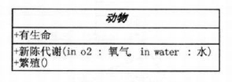
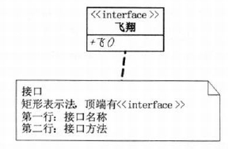
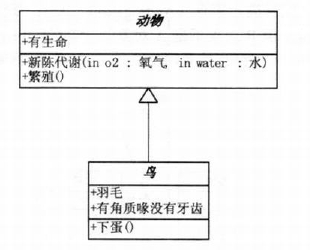
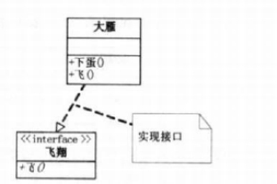
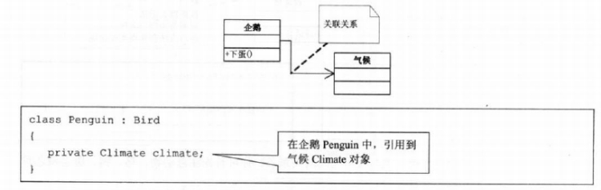
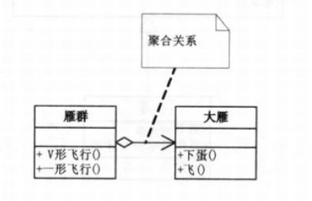
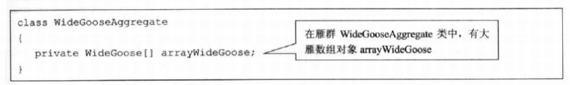
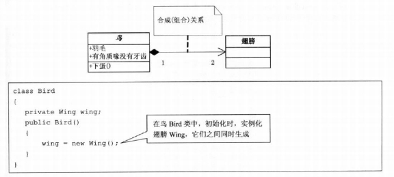
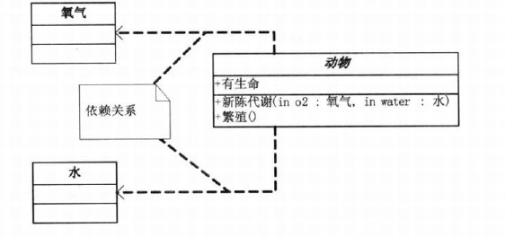
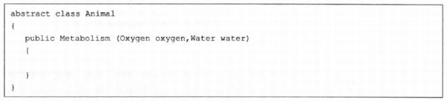

# 一、23种设计模式

参考《大话设计模式》

## 1.1 创建型模式

- [简单工厂模式](src/designpattern/creation/factory/simple/README.md)
- [工厂方法模式](src/designpattern/creation/factory/method/README.md)
- [抽象工厂模式](src/designpattern/creation/factory/abstraction/README.md)
- [原型模式](src/designpattern/creation/prototype/README.md)
- [建造者模式](src/designpattern/creation/builder/README.md)
- [单例模式](src/designpattern/creation/singleton/README.md)

## 1.2 结构型模式

- [适配器模式](src/designpattern/structural/adapter/README.md)
- [桥接模式](src/designpattern/structural/bridge/README.md)
- [组合模式](src/designpattern/structural/composite/README.md)
- [装饰模式](src/designpattern/structural/decorator/README.md)
- [外观模式](src/designpattern/structural/facade/README.md)
- [享元模式](src/designpattern/structural/flyweight/README.md)
- [代理模式](src/designpattern/structural/proxy/README.md)

## 1.3 行为模式（类行为型模式）

- [解释器模式](src/designpattern/behavioral/interpreter/README.md)
- [模板方法模式](src/designpattern/behavioral/template/README.md)

## 1.4 行为模式（对象行为型模式）

- [策略模式](src/designpattern/behavioral/strategy/README.md)
- [观察者模式](src/designpattern/behavioral/observer/README.md)
- [状态模式](src/designpattern/behavioral/state/README.md)
- [备忘录模式](src/designpattern/behavioral/memento/README.md)
- [迭代器模式](src/designpattern/behavioral/iterator/README.md)
- [命令模式](src/designpattern/behavioral/command/README.md)
- [职责链模式](src/designpattern/behavioral/responsibilitychain/README.md)
- [中介者模式](src/designpattern/behavioral/mediator/README.md)
- [访问者模式](src/designpattern/behavioral/visitor/README.md)

# 二、程序设计6大原则

- 单一职责原则（SRP）

  就一个类而言，应该仅有一个引起它变化的原因。

- 里氏替换原则（LSP）

  子类型必须能够替换掉它们的父类型。

- 接口隔离原则

  接口最小化原则

- 依赖倒置原则

  高层模块不应该依赖低层模块，两个都应该依赖抽象； 抽象不应该依赖细节，细节应该依赖抽象；

- 迪米特原则（LoD）

  如果两个类不必彼此直接通信，那么这两个类就不应当发生直接的相互作用。如果其中一个类需要调用另一个类的某一个方法的话，可以通过第三者转发这个调用。

- 开闭原则

  软件实现（类、模块、函数等等）应该可以扩展，但是不可修改。

# 三、UML类图和类之间的关系

## 3.1 UML 类图

### 1. 类

类图分三层：

- 第一层显示类的名称，如果是抽象类，则就用斜体显示。
- 第二层是类的特性，通常就是字段和属性。
- 第三层是类的操作，通常是方法或行为。注意前面的符号，‘+’表示public，‘-’表示private，‘#’表示protected.

### 2. 接口类

第一行是接口名称。第二行是接口方法。

## 3.2 类之间的关系

### 1. 继承类

继承关系用空心三角形 + 实线来表示。

### 2. 实现接口类

实现接口用空心三角形 + 虚线来表示。

### 3. 关联关系

关联关系用实际箭头来表示。

看企鹅和气候两个类，企鹅是很特别的鸟，会游不会飞。更重要的是，它与气候有很大的关联。当一个类知道另一个类时，可以用关联（association）。

### 4. 聚合关系

聚合关系用空心的菱形 + 实绩箭头来表示。

我们再来看大雁与雁群这两个类。

### 5. 组合关系

用实心的菱形 + 实心箭头来表示。

组合关系是一种强的拥有关系，体现了严格的部分和整体的关系，部分和整体的生命周期一样。

在这里鸟和其翅膀就是组合关系，因为它们是部分和整体的关系，并且翅膀和鸟的生命周期是相同的。

另外，你会注意到合成关系的连线两端还有一个数字‘1’和数字‘2’，这被称为基数。

表明这一端的类可以有几个实例，很显然，一个鸟应该有两只翅膀。

如果一个类可能有无数个实例，则就用‘n’来表示。

### 6. 依赖关系

动物几大特征，比如有新陈代谢，能繁殖。而动物要有生命力，需要氧气、水以及食物等。

也就是说，动物依赖于氧气和水。它们之间是依赖关系（Dependency），用虚线箭头来表示。

